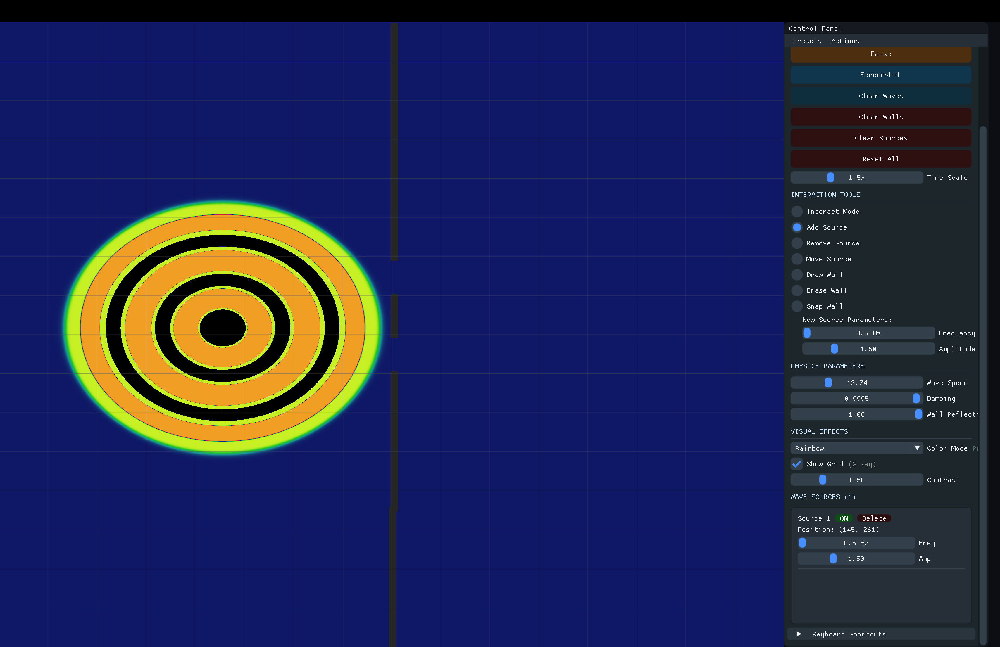
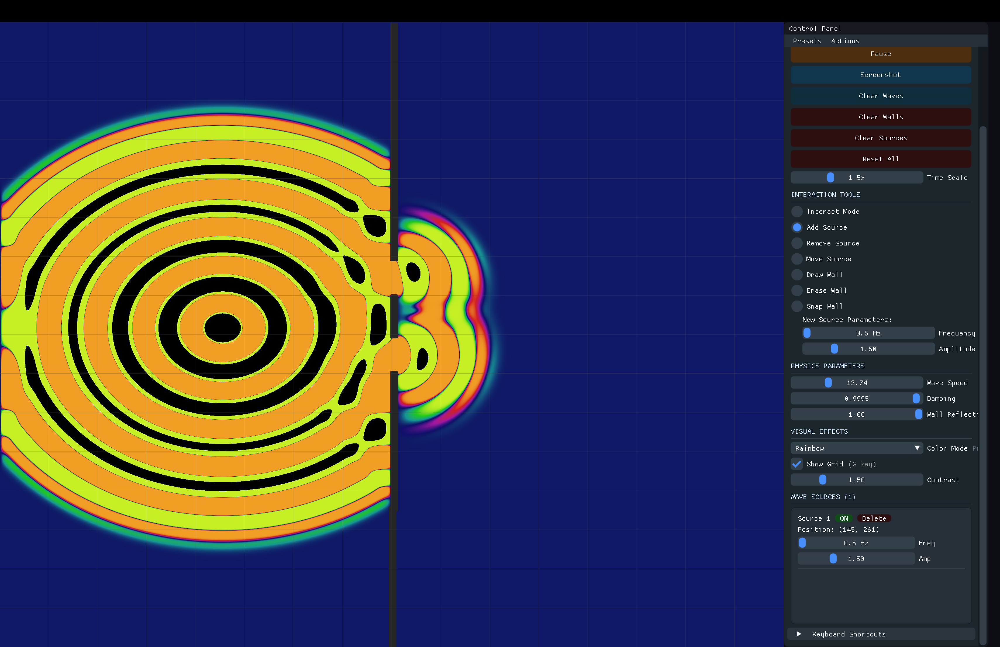

# Wave Simulator




A real-time 2D wave propagation simulator built with OpenGL and C++. Experience classic wave phenomena like interference, diffraction, and reflection through an interactive visualization.

## Key Features

- **Real-time wave simulation** using the 2D wave equation
- **Interactive wave sources** with customizable frequency and amplitude
- **Dynamic wall drawing** for creating barriers and waveguides
- **Multiple visualization modes** (rainbow, grayscale, color gradients)
- **Built-in presets** for classic experiments (double-slit, ripple tank, interference)
- **Screenshot tool** - Press 'P' to capture simulation states

## Installation

### macOS
```bash
brew install cmake glfw
git clone https://github.com/Freblyhet/Wave-Simulator.git
cd Wave-Simulator
mkdir build && cd build
cmake .. && make -j$(sysctl -n hw.ncpu)
./WaveSimulator
```

### Linux
```bash
# Ubuntu/Debian
sudo apt install cmake libglfw3-dev libgl1-mesa-dev

# Fedora
sudo dnf install cmake glfw-devel mesa-libGL-devel

git clone https://github.com/Freblyhet/Wave-Simulator.git
cd Wave-Simulator
mkdir build && cd build
cmake .. && make -j$(nproc)
./WaveSimulator
```

## Controls

### Keyboard
- **SPACE**: Pause/Resume
- **R**: Reset everything
- **C**: Clear waves only
- **G**: Toggle grid overlay
- **P**: Take screenshot
- **ESC**: Cancel snap wall mode

### Mouse Tools (Select in UI)
- **Add Source**: Click to place wave sources
- **Remove Source**: Click sources to remove them
- **Draw Wall**: Click and drag to draw barriers
- **Erase Wall**: Click and drag to remove barriers
- **Snap Wall**: Click two points for straight walls
- **Interact**: Click anywhere to create ripples

## Quick Start

1. Launch the simulator
2. Try a preset from the menu (e.g., "Double Slit")
3. Adjust wave source frequency and amplitude
4. Draw walls to create custom wave patterns
5. Enable grid overlay for precise measurements

## Tips

- Use the "Interact" tool to create instant ripples
- Enable grid overlay (G) for better visualization
- Try different color modes for various effects
- Use "Snap Wall" mode for precise barrier placement

## Documentation

See [`docs/`](docs/) for technical details and advanced features.

## License

MIT License - see [LICENSE](LICENSE) for details.
