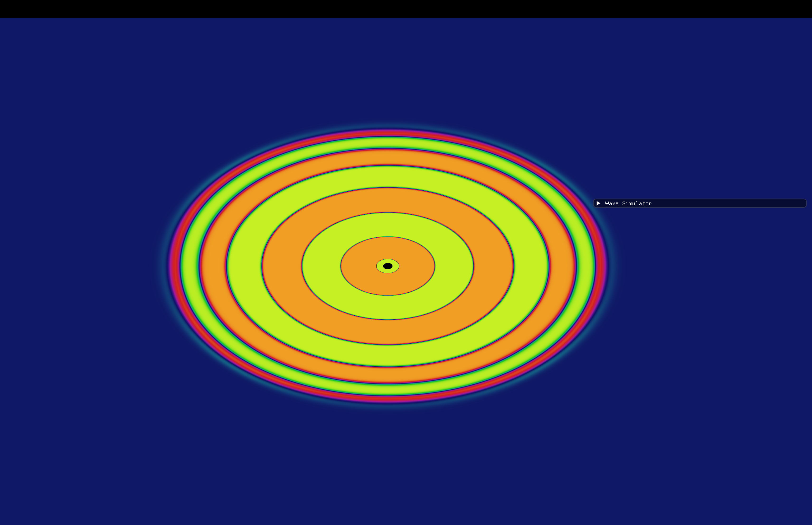

# Wave Simulator# Wave Simulator


A sophisticated real-time 2D wave propagation simulator built with OpenGL and C++. Experience classical wave phenomena like interference, diffraction, and reflection through an interactive visualization with enhanced interaction modes and built-in documentation tools.A real-time 2D wave propagation simulator built with OpenGL and C++. Experience classic wave phenomena like interference, diffraction, and reflection through an interactive visualization.


## Screenshots## Features


- **Real-time wave simulation** using the 2D wave equation

- **Interactive wave sources** with customizable frequency and amplitude

- **Dynamic wall drawing** for creating barriers and obstacles

- **Multiple visualization modes** including rainbow, grayscale, and color gradients

- **Built-in presets** demonstrating classic wave phenomena:

  - Double-slit experiment

  - Ripple tank simulation

  - Wave interference patterns

  - Reflection demonstrations

  - Circular wave arena


## Screenshots

## Features


### Advanced Wave Simulation

- **Real-time wave propagation** using the 2D wave equation with optimized performance

- **Interactive wave sources** with customizable frequency and amplitude controls

- **Dynamic wall drawing** for creating complex barriers and waveguides

- **High-resolution grid** (512x512) for detailed wave behavior

- **Adjustable physics parameters** including wave speed, damping, and time scaling


### Enhanced Interaction System## Requirements

- **Interact Mode**: Click anywhere to create instant ripple effects and observe wave propagation

- **Source Management**: Add and remove wave sources with precise positioning- **macOS** (tested on macOS with Apple Silicon)

- **Wall Tools**: Draw, erase, or snap-create walls with multiple drawing modes- **Xcode Command Line Tools** or equivalent C++ compiler

- **Real-time Parameter Control**: Adjust frequency, amplitude, and physics on-the-fly- **OpenGL 3.3+** support

- **Homebrew** (recommended for dependency management)

### Professional Visualization

- **Multiple visualization modes** including rainbow, grayscale, and color gradients## Dependencies

- **Grid overlay** for precise measurement and analysis

- **Real-time performance monitoring** with FPS displayThis project uses the following libraries (included in the repository):

- **Simulation statistics** showing active sources and time progression- **GLFW 3.4** - Window management and input handling

- **GLAD** - OpenGL function loader

### Built-in Screenshot System- **Dear ImGui** - Immediate mode GUI for controls

- **Press 'P' for instant screenshots** with automatic timestamping- **GLM** - OpenGL mathematics library

- **Visual notification system** confirming successful captures

- **Organized file management** in dedicated WaveSimScreenshots directory## Quick Start

- **Perfect for documentation** and sharing experimental results

### 1. Clone the Repository

### Educational Presets```bash

Demonstrate classic wave phenomena with built-in configurations:git clone https://github.com/Freblyhet/Wave-Simulator.git

- **Double-slit experiment** - Quantum mechanics visualizationcd Wave-Simulator

- **Ripple tank simulation** - Classic physics demonstration```

- **Wave interference patterns** - Constructive and destructive interference

- **Reflection demonstrations** - Boundary condition exploration### 2. Install Dependencies (if not already installed)

- **Circular wave arena** - Radial wave propagation studies```bash

# Install GLFW via Homebrew

## Controls & Interactionbrew install glfw

```

### Interaction Modes

**Interact Mode** (Default):### 3. Build the Project

- **Left Click**: Create instant ripple effects at cursor positionThe project includes a pre-configured build task. Simply run:

- **Drag**: Continuous ripple generation for dynamic wave creation```bash

clang++ src/WaveSim.cpp src/glad.c lib/imgui/imgui.cpp lib/imgui/imgui_draw.cpp lib/imgui/imgui_widgets.cpp lib/imgui/imgui_tables.cpp lib/imgui/backends/imgui_impl_glfw.cpp lib/imgui/backends/imgui_impl_opengl3.cpp -Iinclude -Iglfw-3.4/include -Ilib/imgui -Ilib/imgui/backends -I/opt/homebrew/include -L/opt/homebrew/lib -lglfw -framework Cocoa -framework IOKit -framework CoreVideo -framework OpenGL -framework CoreFoundation -std=c++17 -o "Wave Sim"

**Source Management**:```

- **Add Source**: Place persistent wave sources with custom parameters

- **Remove Source**: Click to remove existing wave sourcesOr if you have VS Code with the provided tasks.json:

```bash

**Wall Tools**:# In VS Code: Cmd+Shift+P -> "Tasks: Run Build Task"

- **Draw Wall (Drag)**: Create barriers by dragging the mouse```

- **Erase Wall (Drag)**: Remove walls by dragging over them

- **Snap Wall**: Two-click mode for precise straight wall placement### 4. Run the Simulator

```bash

### Keyboard Shortcuts./Wave\ Sim

- **SPACE**: Pause/Resume simulation```

- **P**: Take screenshot with visual notification

- **R**: Reset everything (clear waves, walls, and sources)## How to Use

- **C**: Clear waves only (keep sources and walls)

- **G**: Toggle grid overlay for precise measurements### Basic Controls

- **ESC**: Cancel snap wall mode when active- **Left Mouse**: Interact based on selected tool

- **Space**: Pause/Resume simulation

### Interface Panels- **R**: Reset entire simulation

- **Real-time Controls**: Pause/resume, time scaling, and quick clear options- **C**: Clear waves only

- **Wave Source Management**: Add, remove, and configure wave sources- **W**: Clear walls only

- **Physics Parameters**: Adjust wave speed, damping, and simulation properties- **S**: Clear sources only

- **Visualization Options**: Toggle grid, change display modes

- **Preset Experiments**: Load classic wave demonstration setups### Tools

1. **Add Source**: Click anywhere to add a wave source

## Getting Started2. **Remove Source**: Click on existing sources to remove them

3. **Draw Wall**: Click and drag to draw barrier walls

### System Requirements4. **Erase Wall**: Click and drag to erase walls

- **macOS 10.14+** with OpenGL 3.3+ support5. **Snap Wall**: Click two points to create a straight wall

- **4GB RAM** minimum, 8GB recommended for complex simulations

- **Modern graphics card** for smooth real-time visualization### GUI Panel

The control panel on the left provides:

### Installation & Building- **Simulation controls**: Play/pause, time scaling, reset options

- **Presets**: Quick setups for classic wave experiments

```bash- **Physics parameters**: Wave speed and damping adjustment

# 1. Install dependencies via Homebrew- **Visual options**: Color modes, grid overlay, display toggles

brew install cmake glfw glm- **Source management**: Individual control over each wave source


# 2. Clone or download the project## Physics

cd WaveSim

The simulator implements the 2D wave equation:

# 3. Compile (using provided command)```

clang++ -std=c++17 src/WaveSim.cpp src/glad.c \∂²u/∂t² = c²(∂²u/∂x² + ∂²u/∂y²)

  lib/imgui/imgui.cpp lib/imgui/imgui_draw.cpp \```

  lib/imgui/imgui_widgets.cpp lib/imgui/imgui_tables.cpp \

  lib/imgui/backends/imgui_impl_glfw.cpp \Where:

  lib/imgui/backends/imgui_impl_opengl3.cpp \- `u(x,y,t)` is the wave amplitude at position (x,y) and time t

  -Iinclude -Ilib/imgui -Ilib/imgui/backends \- `c` is the wave speed (adjustable in the GUI)

  -I/opt/homebrew/include -L/opt/homebrew/lib \- Damping is applied to simulate energy dissipation

  -lglfw -framework Cocoa -framework IOKit \

  -framework CoreVideo -framework OpenGL \## Project Structure

  -framework CoreFoundation -o "Wave Sim"

```

# 4. Run the simulationWave-Simulator/

./"Wave Sim"├── src/

```│   ├── WaveSim.cpp          # Main application source

│   └── glad.c               # OpenGL loader

### Quick Start Guide├── include/

│   ├── glad/                # OpenGL headers

1. **Launch the application** - You'll see an empty wave simulation grid│   └── KHR/                 # Khronos headers

2. **Start with Interact Mode** - Click anywhere on the grid to create ripples├── lib/

3. **Try the presets** - Load "Double Slit" or "Ripple Tank" for classic demonstrations│   ├── imgui/               # Dear ImGui library

4. **Add persistent sources** - Switch to "Add Source" mode and place wave generators│   └── libglfw3.a          # Pre-built GLFW library

5. **Create barriers** - Use wall tools to build complex wave guides and obstacles├── resources/

6. **Document your experiments** - Press 'P' to take screenshots of interesting patterns│   └── shaders/            # GLSL shader files

├── WaveSimScreenshots/     # Demo images

## Educational Applications└── glfw-3.4/              # GLFW source (reference)

```

### Physics Education

- **Wave Mechanics**: Demonstrate fundamental wave properties and behaviors## Example Experiments

- **Interference Studies**: Explore constructive and destructive wave interference

- **Boundary Conditions**: Investigate wave reflection and transmission at interfaces### 1. Double Slit Experiment

- **Frequency Analysis**: Study the relationship between frequency and wavelength1. Load the "Double Slit" preset

2. Observe the characteristic interference pattern

### Research Applications3. Try adjusting the frequency to see how wavelength affects the pattern

- **Wave Optics Modeling**: Simulate optical phenomena using wave principles

- **Acoustic Simulation**: Model sound wave propagation in 2D environments### 2. Wave Interference

- **Signal Processing**: Visualize wave interactions and filtering effects1. Add two sources close to each other

- **Algorithm Development**: Test wave-based computational methods2. Set them to the same frequency

3. Watch constructive and destructive interference patterns form

## Technical Details

### 3. Reflection Studies

### Simulation Engine1. Draw walls at various angles

- **Finite Difference Method** for solving the 2D wave equation2. Add a source and observe how waves reflect off barriers

- **Optimized Grid Updates** with efficient memory management3. Try creating a parabolic reflector shape

- **Adaptive Time Stepping** for stable long-term simulations

- **Boundary Condition Handling** for realistic wave interactions## Author


### Performance FeaturesAdam Blyberg  

- **Real-time Rendering** at 60+ FPS on modern hardware[GitHub](https://github.com/Freblyhet)

- **Efficient OpenGL Pipeline** with optimized shader programs

- **Memory Management** for large grid simulations---

- **Cross-platform Compatibility** via GLFW and modern OpenGL

**Enjoy exploring the fascinating world of wave physics!**
## New in Version 2.0

### Enhanced Interaction
- **Interactive Ripple Mode**: Click to create instant wave effects
- **Improved User Interface**: Cleaner layout with organized tool sections
- **Keyboard Shortcuts Panel**: Built-in reference for all controls

### Professional Documentation
- **Built-in Screenshot System**: Press 'P' for instant capture with notifications
- **Automatic File Organization**: Screenshots saved to dedicated directory
- **Visual Feedback**: Real-time confirmation of screenshot capture

### Improved Workflow
- **Default Interact Mode**: More intuitive starting experience for new users
- **Enhanced Tool Descriptions**: Clear explanations for each interaction mode
- **Better Parameter Control**: Streamlined physics adjustment interface

## Contributing

This project demonstrates advanced OpenGL techniques, real-time physics simulation, and interactive educational software design. Feel free to:

- **Experiment with parameters** to discover new wave behaviors
- **Create educational content** using the screenshot system
- **Extend the simulation** with additional physics models
- **Improve visualization** with new rendering techniques

## Acknowledgments

- **OpenGL** for high-performance graphics rendering
- **GLFW** for cross-platform window management
- **ImGui** for immediate-mode user interface
- **GLM** for efficient mathematical computations
- **Wave physics community** for educational inspiration and validation

## License

This educational simulation software is provided for learning and research purposes. See the accompanying license file for specific terms and conditions.